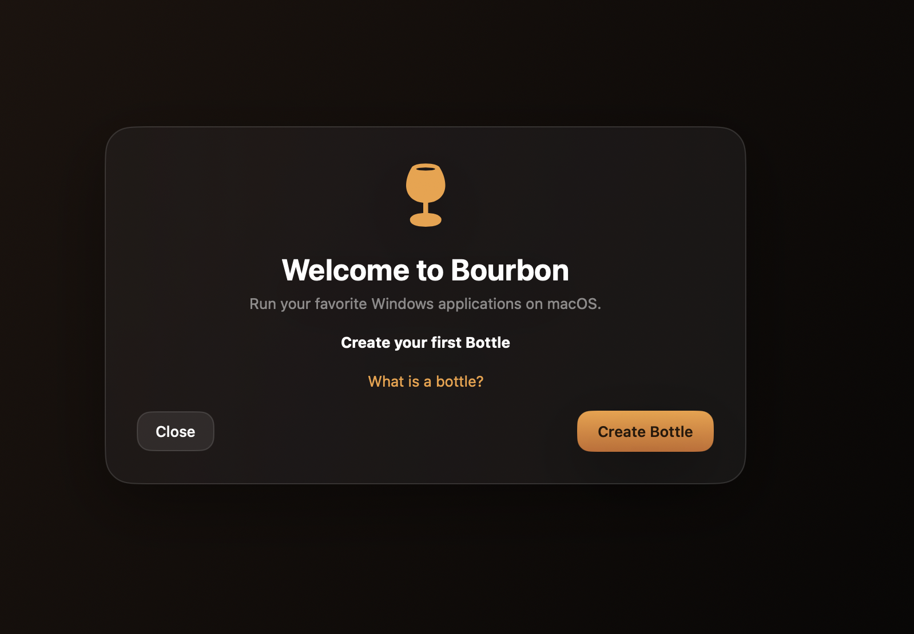
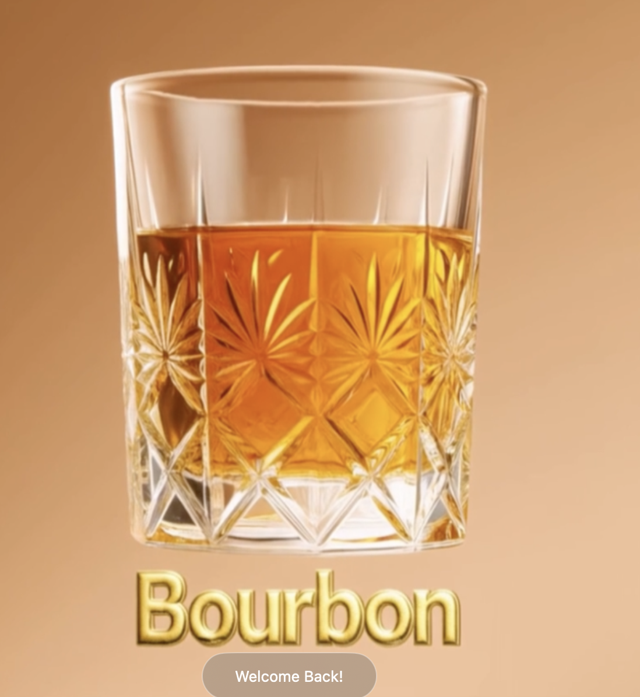
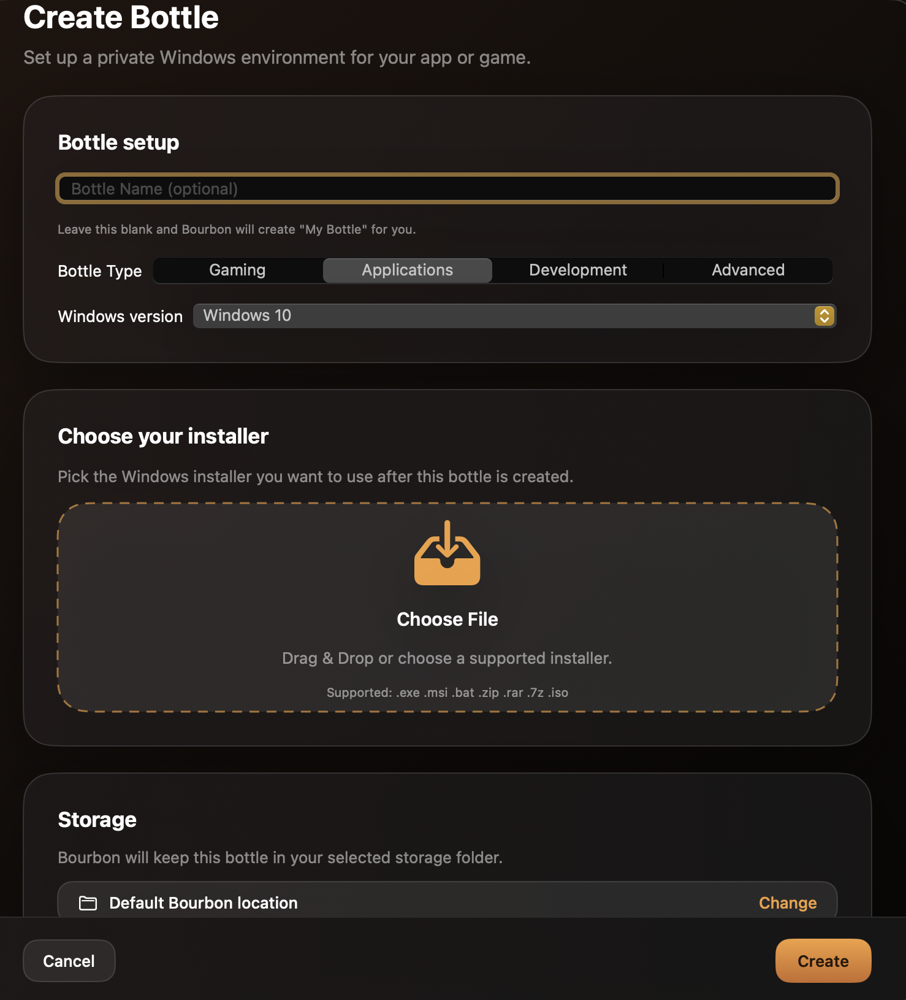
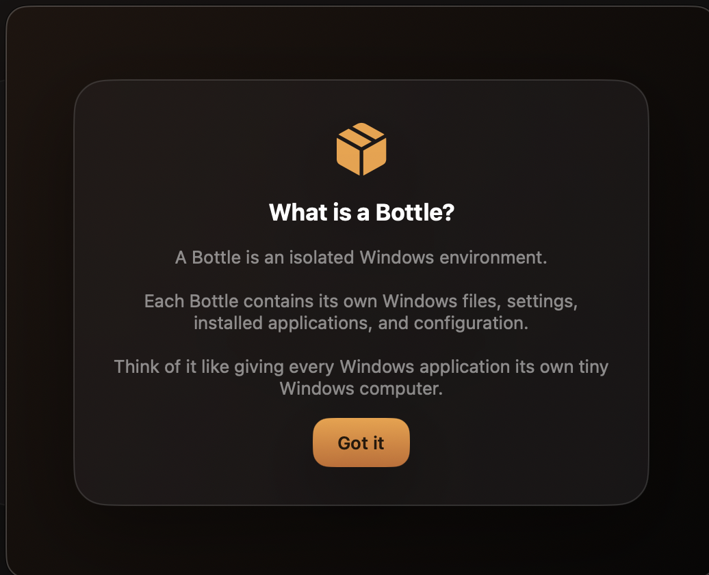

# 🥃 Bourbon

### Modern Windows compatibility for macOS.

Run Windows applications and games on macOS with a native SwiftUI experience.

---

## Welcome to Bourbon

Bourbon is a modern Windows compatibility layer frontend for macOS built entirely in SwiftUI.

Originally inspired by Whisky, Bourbon has grown into its own actively maintained project with modern updates, improved onboarding, automatic updates, community-driven development, and a growing ecosystem.

---

## Features

- 🍾 One-click Bottle creation
- 🖥 Native SwiftUI interface
- ⚡ Automatic Sparkle updates
- 📦 Distillery package manager
- 🐞 Built-in bug reporting
- 🔐 Secure licensing
- 🛠 Runtime API
- 🧪 Stable & Beta release channels

---

## Screenshots

### Welcome Experience

---

### Welcome Back

---

### Create your first Bottle

---

### What is a Bottle?

---

## Requirements

- Apple Silicon
- macOS Sonoma 14+
- Internet connection for downloads & updates

---

## Installation

Download the latest release from the Releases page.

Bourbon includes automatic updates through Sparkle, so once installed you'll always stay up to date.

---

## Community

Join the official Discord.

- Support
- Bug reports
- Beta testing
- Feature requests
- Bourbon Board

---

## Roadmap

Current work includes:

- Distillery expansion
- Bourbon Board
- Improved package management
- More compatibility improvements
- Better onboarding

---

## Credits

Bourbon is built upon years of incredible work from the open-source community.

Special thanks to:

- Wine
- CrossOver
- Sparkle
- MoltenVK
- DXVK-macOS
- Game Porting Toolkit
- SemanticVersion
- Swift Argument Parser

And of course, thank you to Isaac Marovitz for creating Whisky, which inspired Bourbon.

---

## License

See LICENSE for details.
